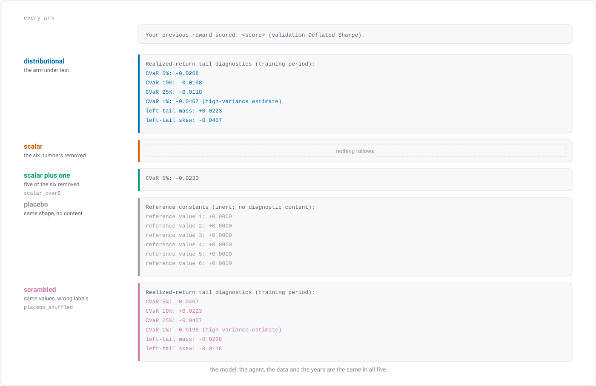
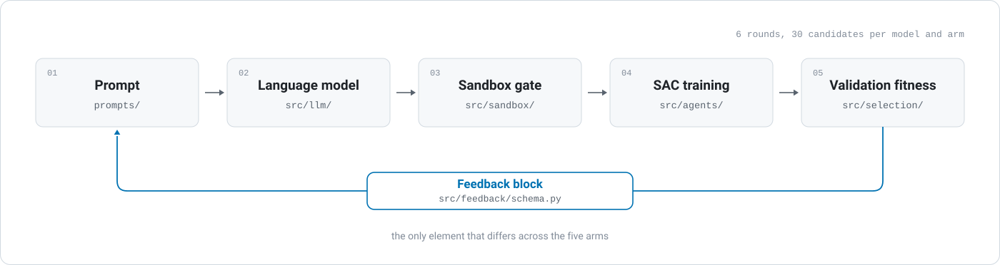

<div align="center">

<picture>
  <source media="(prefers-color-scheme: dark)" srcset="assets/banner-dark.svg">
  <source media="(prefers-color-scheme: light)" srcset="assets/banner-light.svg">
  
</picture>

<br>

[](https://www.python.org/)
[](#the-scale-of-the-experiment)
[](#quality-gates)
[](#quality-gates)
[](PREREGISTRATION.md)
[](provenance/prereg-v2.1.sha256)
[](LICENSE)

**[Overview](#overview)** · **[What the arms change](#what-the-arms-change)** · **[What we found](#what-we-found)** · **[Scale](#the-scale-of-the-experiment)** · **[The loop](#the-reflection-loop)** · **[Reproducing](#reproducing-the-work)** · **[Layout](#repository-layout)**

<sub>Tamer Atesyakar · MSc Banking and Digital Finance · UCL Institute of Finance and Technology<br>Supervisor: Dr Ramin Okhrati</sub>

</div>

<br>

> **A language model writes the reward function. Between attempts it receives a note saying how
> the last one did. How much should that message say about risk?**

## Overview

A language model can write a trading agent's reward function in code, which is the scoring rule the
agent learns from by trial and error. Between attempts the model receives a short feedback block
saying how its last reward scored, and beneath it we may add six labelled numbers about the worst
days. No published experiment we found tests what it should say.

We built five versions of that block, called arms. Eleven models each wrote and revised 30 candidate
rewards under every arm, which gives 55 model-arm cells. Between arms only the block differs, and
never the model, the agent, the data or the years. We then trained a fixed Soft Actor-Critic agent
568 times on each cell's best reward, trading the 30 largest US companies of January 2005 over a
test window that stayed sealed throughout development and was opened exactly once.

We fixed the plan and recorded its hash before that window opened. What came back went against our
prediction, and it is reported here in full. This repository holds the method and the evidence
behind it, which is the code, the frozen design record and the provenance ledger that lets a reader
check every artefact by SHA-256.

## What the arms change

<div align="center">
<picture>
  <source media="(prefers-color-scheme: dark)" srcset="assets/arms-dark.svg">
  <source media="(prefers-color-scheme: light)" srcset="assets/arms-light.svg">
  
</picture>
</div>

<div align="center"><sub>Every arm opens on the same score line. Below it, each arm receives what the frozen schema in <code>src/feedback/schema.py</code> renders for it, and the colours are the ones the figure suite uses throughout the dissertation.</sub></div>

<br>

The six numbers are CVaR at the 1, 5, 10 and 25 per cent levels, left-tail mass, which is the share
of days falling far below the average, and left-tail skew. Four search methods run beside the five
arms as comparators. They get no prompt at all, since they replace the model, and they may only
reweight the six terms of a fixed formula where a model may write anything.

| Arm | What its block contains | Change from the distributional arm |
|---|---|---|
| `distributional` | all six tail numbers under their own labels | the arm under test |
| `scalar` | the score line only | the six numbers removed |
| `scalar_cvar5` | the score line plus one tail number | five of the six removed |
| `placebo` | six zeroes under neutral labels | same shape, no content |
| `placebo_shuffled` | the six real numbers under the wrong labels | same values, wrong labels |

## What we found

Across all 11 models, six zeroes in the prompt beat the six real numbers they replaced. We had
predicted otherwise, and the answer we got is the more interesting one.

- **Six zeroes beat the six real numbers by 0.20 net Sharpe.** No 90 per cent interval on that gap
  reaches zero. On the worst-5% loss the real six do beat the same six mislabelled, which is the one
  measure that control was set to decide, and on return the two arms are level.
- **One number helped and six did not.** Adding the worst-5% loss beat the score line alone by 0.13
  net Sharpe, and the other five numbers cost 0.18 against that gain.
- **The registered prediction did not hold.** We predicted the distributional arm would beat scalar,
  scalar plus one and placebo on the worst-5% loss, and fall no more than 0.0756 net Sharpe behind
  them on return. Both halves had to hold. The first held in two of the 11 models and the second in
  none.
- **Trading cost is where the arms separate.** Before the charge the five lie within 0.04 Sharpe, and
  after it they span 0.25, because agents that traded more scored lower.
- **The written code does not move with the six numbers.** No code property tracks them by more than
  its own noise, and that holds across all 55 cells. The gap is not a resolution limit. Only 0.9 per
  cent of the differences fell below a model's own threshold.
- **Model-written rewards work, but not by the margin the test asked for.** 53 of the 55 cells end
  the test window in profit after the trading charge, and nine of them beat all 11 hand-written
  rewards. Five of those nine came from the placebo arm. Ten of the 11 hand-written rewards end in
  loss once that charge is applied.

## The scale of the experiment

| Quantity | Value |
|---|---|
| Language models writing reward functions | 11 |
| Feedback arms, and numerical search methods beside them | 5 and 4 |
| Comparison units | 71 |
| Candidate budget per model and arm | 30, drawn over 6 rounds |
| Candidate draws planned, and those that produced a working reward | 1,650 and 1,393 |
| Seeds per comparison unit | 568 |
| Environment steps per training | 400,000 |
| Trainings scored on the test window, and run in all | 40,328 and 41,873 |
| Processor-hours consumed | 288,533 |

## The four hypotheses

| | What it asks | What happened |
|---|---|---|
| **H1** | Does the model-written reward beat all 11 hand-written ones? | **No.** It finishes below return minus turnover, the only one of the 11 that makes money. |
| **H2** | Does the distributional arm beat the three arms that tell the model less? *(the headline)* | **Not as predicted.** The worst-loss half held in 2 of 11 models. The return half held in none, because the six numbers cost return. |
| **H3** | Does revising over six rounds beat drawing all 30 candidates at once? | **No.** Revising did worse than one draw of all 30. |
| **H4** | Does the model beat all four numerical search methods at once? | **No.** It beats three of the four and ties the fourth, and the rule needs all four. |

H1, H2 and H4 each require the claim to hold against every comparator at once, and the verdict
follows the weakest single comparison.

## The reflection loop

<div align="center">
<picture>
  <source media="(prefers-color-scheme: dark)" srcset="assets/loop-dark.svg">
  <source media="(prefers-color-scheme: light)" srcset="assets/loop-light.svg">
  
</picture>
</div>

<div align="center"><sub>One generation of the loop. The five stages are common to every arm, and the block returning along the foot is where the arms differ.</sub></div>

<br>

Each generation prompts the model for a reward function, puts the returned source through an AST
gate and a sandboxed subprocess, trains the fixed agent on it, and scores the result on a held-out
validation Deflated Sharpe that the reward itself never enters. We then measure the realised
training returns, render the arm's feedback block from that measurement, and carry the block into
the next prompt. Every prompt, response, reward source and token count is archived while the run is
happening, which is what later lets the analysis replay from disk.

## Contributions

| | Contribution |
|---|---|
| **One** | **A way to measure what richer feedback adds.** As far as we can find, nobody has had a language model write the reward code for an agent that has to manage risk, and no published experiment compares one level of detail about risk against another. Of 56 ablation experiments across 15 studies, not one ran a placebo and none fixed an analysis plan in advance, which makes this the first pre-registered study we know of in automated reward design. The feedback signal needs no access to the learner, since we read it from the agent's own returns. |
| **Two** | **What we found.** Three competing explanations for why the six numbers leave no mark on return, each leaving a different measurable trace. Failure rates for writing working code that run from none at all to 86 per cent across the 11 models. All 11 hand-written rewards make money before the trading charge and ten lose it after. |
| **Three** | **What went against our expectations.** One number about the worst days helps, all six hurt, and six zeroes beat the six real numbers, with no 90 per cent interval on those gaps reaching zero. On the ten models whose two authoring runs matched in candidates and seeds, the two runs name a different winning arm for four of them. |

## Getting started

```bash
git clone https://github.com/abailey81/agentic-reward-engineering.git
cd agentic-reward-engineering
python -m venv .venv && source .venv/bin/activate   # Windows: .venv\Scripts\activate
pip install -r requirements.lock                    # the exact pinned environment
pip install -e .
```

Three commands then establish that the design is intact, that the code behaves, and that the
machinery reproduces a known result. None of them needs the licensed panel or an API key.

```bash
make freeze-check      # recompute the design hash over the nine frozen artefacts
make test-fast         # the deterministic core, with no GPU and no network
make reproduce         # a keyless golden reproduction on a synthetic panel
```

The deterministic core, which covers inference, measurement, the sandbox, the baselines and the
environment, runs on a light scientific stack. In practice only the agent-training and
model-authoring paths need PyTorch, Stable-Baselines3 and an API key.

## Reproducing the work

Each stage below is a single command. The first three need neither the licensed panel nor an API
key, which lets a fresh clone run them straight away. The later stages read the licensed panel,
the campaign archive, or both.

| Stage | Command | What it establishes |
|---|---|---|
| Design integrity | `make freeze-check` | Recomputes the canonical design hash over the nine frozen artefacts and re-runs the prose-versus-config consistency gate. Read-only. |
| Test suite | `make test-fast` | The deterministic core, with no GPU and no network. |
| End-to-end reproduction | `make reproduce` | A keyless golden reproduction on a shape-identical synthetic panel, where the whole machinery runs deterministically without the licensed data. |
| Training-budget study | <code>python&nbsp;scripts/learning_curve.py</code> | The measured convergence curve behind the per-candidate step budget. |
| Statistical power | `make power` | The minimum detectable effect and the equivalence bound for the headline test. |
| Campaign | `make campaign` | The confirmatory run. It is idempotent, safe to resume with `--resume`, and needs the licensed panel and an API key. |
| Analysis | <code>python&nbsp;scripts/analyze_campaign.py</code> | Hypothesis tests, multiplicity control, mechanism analysis and the result tables. |
| Figures | `make figures` | The figure suite for the write-up. |
| Repository audit | <code>python&nbsp;scripts/audit_reproducibility.py</code> | Scores the repository against its own reproducibility contract. |

### Running the campaign

We ran the confirmatory campaign on the **UCL Myriad HPC cluster** under SGE, orchestrated by
`scripts/run_campaign_cluster.py`, with device-homogeneous pools so that every common-random-number
comparison stays inside one hardware block. We keep a laptop track in full parity as the certified
fallback, running the same science primitives on both. A parallel run is proved numerically
equivalent to a serial one in `tests/test_test_leg_equivalence.py`, to an absolute tolerance
of 1e-6.

## Why the design holds up

| Threat | How we handle it |
|---|---|
| **Garden of forking paths** | Before any confirmatory run we froze the design, hypotheses, arms, budgets, splits and the whole analysis plan in [`PREREGISTRATION.md`](PREREGISTRATION.md), binding them with a SHA-256 hash over nine artefacts. Every later change is a dated amendment. |
| **Survivorship and look-ahead bias** | A survivorship-free, point-in-time equity panel that retains delisted names, with purged and embargoed train, validation and sealed-test splits. |
| **"No effect because it never trained"** | The per-candidate budget is set from a measured learning-curve study and applied identically across arms, with the convergence diagnostic disclosed alongside the result. |
| **Reward hacking** | Model-authored code is AST-gated and executed in a sandboxed subprocess. Selection runs on a tail-blind, reward-independent held-out Deflated Sharpe, which the sealed test never informs. |
| **Multiplicity** | A frozen family of six tests, intersection-union tests for the co-primary contrasts, Benjamini-Hochberg control, and a registered graphical alpha-recycling tier. |
| **Inference rigour** | Stratified-bootstrap interquartile-mean intervals, TOST equivalence, Bayes factors, the Model Confidence Set, PBO and CSCV, Deflated and Probabilistic Sharpe, FZ0 value-at-risk and expected-shortfall backtests, extreme-value tail fits, and factor attribution. |
| **A result that is only one model's** | Every arm runs on all 11 models, and the claim is the count across them rather than the best cell. |
| **Reproducibility** | Because model calls are not reproducible, we replay results from an on-disk provenance archive. Every prompt, authored reward, feedback block and token count is archived while the run is happening. |

## Data availability

The headline results use a licensed Refinitiv/LSEG panel of US daily total returns that we cannot
redistribute. It covers 5,406 sessions from January 2005 to 30 June 2026 and the 963 companies that
were in the S&P 500 at any point, of which the agent may hold the 30 largest by market value in
January 2005, plus cash. Training runs to 2016, validation covers 2017 to 2019, and the test window
runs from 2020 to 30 June 2026.

This repository therefore ships the acquisition pipeline, the SHA-256 checksums and the provenance
lineage. An entitled user can rebuild the panel byte-for-byte and check it against the frozen
reference with `python scripts/verify_gold.py`. The panel itself is deliberately absent.

However, the method is still verifiable end to end without the licensed panel. `make reproduce` runs
the whole machinery on a synthetic panel of identical shape and asserts a byte-stable result, which
may be the strongest check available to a reader who holds no entitlement.

## Determinism and provenance

We treat determinism as a requirement of the analysis, which the code is built around in four
places.

- Since model calls are not reproducible, results **replay from the archive**. Every prompt,
  response, authored reward source, reward hash, feedback block and token count is written to disk
  while the run is happening.
- Seeding is centralised, with the seed set fixed as a pre-registered schedule that runs to 568 seeds.
- Thread counts, device identity and float32 matmul precision belong to the determinism envelope and
  appear in every record, because a knob that varies across records without being recorded may
  silently confound a paired comparison.
- A content-addressed integrity seal binds the archive to the exact commit that produced it, so any
  record and the code that wrote it can be matched again by SHA-256.

## Quality gates

| Gate | Command | Scope |
|---|---|---|
| Design-hash drift | `make freeze-check` | 23 consistency checks over the nine frozen artefacts |
| Lint | `make lint` | `src`, `tests`, `scripts` |
| Types | `make typecheck` | `src` |
| Tests | `make test` | 3,008 on this tree: 2,970 deterministic-core, 15 agent-training, 23 data-pipeline |
| Coverage floor | `pytest --cov=src` | 88 per cent of `src` after documented exclusions |
| Mutation-testing exhibit | `make mutation` | The core numeric modules |
| Supply-chain scan | `make audit` | The pinned dependency set |

The dissertation reports 2,883 tests passing at the campaign's final gate, and 2,875 at the
pre-launch gate before it. The suite has grown since, which is why this tree runs more.

The same gates are written out as a continuous-integration workflow in
[`.github/workflows/ci.yml`](.github/workflows/ci.yml), which runs the freeze gate, the lint, the
deterministic-core suite with coverage, the agent-training suite and the data-pipeline suite.

## Repository layout

<details>
<summary>The full tree, and what each directory is for</summary>

```text
src/
  env/            Portfolio MDP; the reward is injected through a callable slot
  feedback/       Tail-risk measurement (empirical and extreme-value) and the per-arm feedback schema
  reward/         The reward contract
  sandbox/        AST gate and subprocess isolation for model-authored code
  selection/      Held-out Deflated-Sharpe fitness (reward-independent)
  agents/         Stable-Baselines3 SAC, the registered headline learner, and the registered TQC
                  secondary critic; PopArt value normalisation
  llm/            The reflection loop and a pinned, fully archived model client
  arms/           Builds the experimental arms and the search baselines from config
  search/         Search baselines: random search over code, and three optimisers over a template
  inference/      Bootstrap, PBO/CSCV, Deflated Sharpe, Bayes null, Model Confidence Set, reward-code distance
  viz/            Publication-grade figure engine (Okabe-Ito palette, honest-null discipline)
  cluster/        UCL Myriad (SGE) adapter: content-addressed specs, batch driver, campaign orchestrator
  io/ utils/      Results schema and the single analysis loader; deterministic seeding, config, provenance
config/           Fourteen YAML files: the single source of truth. Code reads config and never hardcodes.
prompts/          Versioned prompt templates used in every arm
scripts/          Entry points: smoke_test, learning_curve, power_analysis, freeze, run_campaign,
                  run_campaign_cluster, analyze_campaign, make_figures, reproduce_synthetic, monitor
tests/            Behaviour tests: invariances, bounds, calibration, and a parallel-equals-serial replay proof
data_pipeline/    Self-contained Refinitiv/LSEG acquisition pipeline with checksums and lineage
data/manifest/    The provenance ledger: SHA-256 and lineage for every artefact, with no payloads
provenance/       The SHA-256 attestation of each frozen design version
docs/             The SESOI derivation the frozen pre-registration cites
PREREGISTRATION.md  The frozen design record and its amendment log
```

</details>

## Citation

Please cite through [`CITATION.cff`](CITATION.cff). The frozen experimental design is recorded in
[`PREREGISTRATION.md`](PREREGISTRATION.md), and its hash in
[`provenance/`](provenance/).

## Licence

[MIT](LICENSE). The licensed market data falls outside it and is not distributed here.
