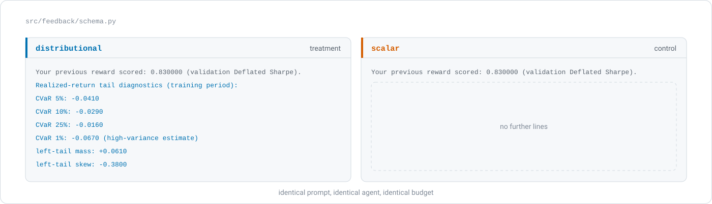

<div align="center">

<picture>
  <source media="(prefers-color-scheme: dark)" srcset="assets/banner-dark.svg">
  <source media="(prefers-color-scheme: light)" srcset="assets/banner-light.svg">
  
</picture>

<br>

[](https://www.python.org/)
[](#quality-gates)
[](#quality-gates)
[](PREREGISTRATION.md)
[](provenance/prereg-v2.1.sha256)
[](LICENSE)

**[Overview](#overview)** · **[What varies](#what-varies-between-arms)** · **[The loop](#the-reflection-loop)** · **[Reproducing](#reproducing-the-work)** · **[Design integrity](#why-the-design-holds-up)** · **[Layout](#repository-layout)**

<sub>Tamer Atesyakar · MSc Banking and Digital Finance · UCL Institute of Finance and Technology<br>Supervisor: Dr Ramin Okhrati</sub>

</div>

<br>

> **Does a language model write better reward code when its prompt includes a multi-level tail-risk
> profile, or does a single performance number do just as well?**

## Overview

We use a large language model as an automated reward engineer. Through an Eureka-style reflection
loop it writes the Python reward function that a fixed Soft Actor-Critic agent then optimises while
that agent allocates a long-only equity portfolio.

The one thing we vary between arms is the feedback the designer receives between iterations. In the
treatment condition its prompt includes six coherent statistics about the left tail of the realised
returns, which the control condition replaces with a single performance number. Because we hold the
agent, the data, the search budget and the evaluation identical everywhere, any difference in the
reward code that comes back is attributable to the information in that feedback and to nothing else
in the loop.

We evaluate a pre-registered, placebo-controlled design on a survivorship-free, point-in-time equity
panel whose final period stays sealed until a single registered read on the pre-registered date.
Four further arms separate the information in that feedback from everything travelling with it: a
single-CVaR arm with one tail level, a placebo matched in length and field count, a shuffled placebo
with the treatment's exact structure and deranged values, and a scalar control supplying the
performance number alone. This repository holds the method and the evidence behind it, which is the
code, the frozen design record and the provenance ledger that lets a reader check every artefact by
SHA-256.

## What varies between arms

<div align="center">
<picture>
  <source media="(prefers-color-scheme: dark)" srcset="assets/contrast-dark.svg">
  <source media="(prefers-color-scheme: light)" srcset="assets/contrast-light.svg">
  
</picture>
</div>

<div align="center"><sub>The arm block that <code>src/feedback/schema.py</code> renders into the reflection prompt. Both arms open on the same header line, and we add the six tail statistics beneath it in the treatment arm alone.</sub></div>

<br>

The six statistics are CVaR at the 1, 5, 10 and 25 per cent levels, left-tail mass, which is the
probability of a return below minus two standard deviations, and robust skew. We call them
multi-level tail-risk feedback rather than a distributional prompt, because they are a
theory-grounded summary of the lower tail and not the full return distribution.

## The reflection loop

<div align="center">
<picture>
  <source media="(prefers-color-scheme: dark)" srcset="assets/loop-dark.svg">
  <source media="(prefers-color-scheme: light)" srcset="assets/loop-light.svg">
  
</picture>
</div>

<div align="center"><sub>One generation of the loop. The five stages are common to every model arm, and the block returning along the foot is where the arms differ.</sub></div>

<br>

Each generation prompts the model for a reward function, puts the returned source through an AST
gate and a sandboxed subprocess, trains the fixed agent on it, and scores the result on a held-out
validation Deflated Sharpe that the reward itself never enters. We then measure the realised
training returns, render the arm's feedback block from that measurement, and carry the block into
the next prompt. Every prompt, response, reward source and token count is archived while the run is
happening, which is what later lets the analysis replay from disk.

## The nine arms

Five of the nine arms route through the language model, leaving four search baselines that never
call it.

| Arm | Family | What it isolates |
|---|---|---|
| `distributional` | Model | The treatment: a performance number and the six-statistic tail profile. |
| `scalar` | Model | The control: the same loop with a performance number alone. |
| `scalar_cvar5` | Model | One tail level only. Separates any tail information from a *profile* of it. |
| `placebo` | Model | A block matched in length and field count, carrying inert values. Separates information from token budget. |
| `placebo_shuffled` | Model | The treatment block's exact structure with its values deranged. Separates content from shape. |
| `random_search` | Search | Random search over reward code. Isolates search quality from authorship. |
| `bayes_opt` | Search | Gaussian-process expected improvement over a fixed reward template. |
| `cma_es` | Search | CMA-ES over the same template, an evolution-strategy comparator. |
| `tpe` | Search | Tree-structured Parzen estimator over the same template, a density-ratio comparator. |

The pre-registration fixes four hypotheses. H2, the feedback contrast, is the headline. H1 measures
the authored reward against an eleven-member canon of hand-written rewards, H3 separates the
reflection loop from single-shot generation, and H4 is the portfolio of search baselines.

## Contributions

| | Contribution |
|---|---|
| **N1** | As far as we have been able to establish, this is the first study to supply a language-model reward designer with a multi-level tail-risk profile, and to test it against matched scalar and placebo feedback under a pre-registered equivalence design. |
| **N2** | It also appears to be the first Eureka-style synthesis of reward *code* for a trading and portfolio agent. Earlier reward-as-code work comes from robotics and control. The nearest finance work has the model emit a signal while leaving the reward itself hand-written. |
| **N3** | A contamination-aware, multiplicity-honest evaluation protocol for model-authored reward code. We adopted and adapted this from existing practice, and claim no novelty for the protocol. |

## Getting started

```bash
git clone https://github.com/abailey81/agentic-reward-engineering.git
cd agentic-reward-engineering
python -m venv .venv && source .venv/bin/activate   # Windows: .venv\Scripts\activate
pip install -r requirements.lock                    # the exact pinned environment
pip install -e .
```

Three commands then establish that the design is intact, that the code behaves, and that the
machinery reproduces a known result. None of them needs the licensed panel or an API key.

```bash
make freeze-check      # recompute the design hash over the nine frozen artefacts
make test-fast         # the deterministic core, with no GPU and no network
make reproduce         # a keyless golden reproduction on a synthetic panel
```

The deterministic core, which covers inference, measurement, the sandbox, the baselines and the
environment, runs on a light scientific stack. In practice only the agent-training and
model-authoring paths need PyTorch, Stable-Baselines3 and an API key.

## Reproducing the work

Each stage below is a single command. The first three need neither the licensed panel nor an API
key, which lets a fresh clone run them straight away. The later stages read the licensed panel,
the campaign archive, or both.

| Stage | Command | What it establishes |
|---|---|---|
| Design integrity | `make freeze-check` | Recomputes the canonical design hash over the nine frozen artefacts and re-runs the prose-versus-config consistency gate. Read-only. |
| Test suite | `make test-fast` | The deterministic core, with no GPU and no network. |
| End-to-end reproduction | `make reproduce` | A keyless golden reproduction on a shape-identical synthetic panel, where the whole machinery runs deterministically without the licensed data. |
| Training-budget study | <code>python&nbsp;scripts/learning_curve.py</code> | The measured convergence curve behind the per-candidate step budget. |
| Statistical power | `make power` | The minimum detectable effect and the equivalence bound for the headline test. |
| Campaign | `make campaign` | The confirmatory run. It is idempotent, safe to resume with `--resume`, and needs the licensed panel and an API key. |
| Analysis | <code>python&nbsp;scripts/analyze_campaign.py</code> | Hypothesis tests, multiplicity control, mechanism analysis and the result tables. |
| Figures | `make figures` | The figure suite for the write-up. |
| Repository audit | <code>python&nbsp;scripts/audit_reproducibility.py</code> | Scores the repository against its own reproducibility contract. |

### Running the campaign

We run the confirmatory campaign on the **UCL Myriad HPC cluster** under SGE, orchestrated by
`scripts/run_campaign_cluster.py`, with device-homogeneous pools so that every common-random-number
comparison stays inside one hardware block. We keep a laptop track in full parity as the certified
fallback, running the same science primitives on both. A parallel run is proved numerically
equivalent to a serial one in `tests/test_test_leg_equivalence.py`, to an absolute tolerance
of 1e-6.

## Why the design holds up

| Threat | How we handle it |
|---|---|
| **Garden of forking paths** | Before any confirmatory run we froze the design, hypotheses, arms, budgets, splits and the whole analysis plan in [`PREREGISTRATION.md`](PREREGISTRATION.md), binding them with a SHA-256 hash over nine artefacts. Every later change is a dated amendment. |
| **Survivorship and look-ahead bias** | A survivorship-free, point-in-time equity panel that retains delisted names, with purged and embargoed train, validation and sealed-test splits. |
| **"No effect because it never trained"** | The per-candidate budget is set from a measured learning-curve study and applied identically across arms, with the convergence diagnostic disclosed alongside the result. |
| **Reward hacking** | Model-authored code is AST-gated and executed in a sandboxed subprocess. Selection runs on a tail-blind, reward-independent held-out Deflated Sharpe, which the sealed test never informs. |
| **Multiplicity** | A frozen family of six tests, intersection-union tests for the co-primary contrasts, Benjamini-Hochberg control, and a registered graphical alpha-recycling tier. |
| **Inference rigour** | Stratified-bootstrap interquartile-mean intervals, TOST equivalence, Bayes factors, the Model Confidence Set, PBO and CSCV, Deflated and Probabilistic Sharpe, FZ0 value-at-risk and expected-shortfall backtests, extreme-value tail fits, and factor attribution. |
| **Reproducibility** | Because model calls are not reproducible, we replay results from an on-disk provenance archive. Every prompt, authored reward, feedback block and token count is archived while the run is happening. |

## Data availability

The headline results use a licensed Refinitiv/LSEG equity panel that we cannot redistribute. This
repository therefore ships the acquisition pipeline, the SHA-256 checksums and the provenance
lineage. An entitled user can rebuild the panel byte-for-byte and check it against the frozen
reference with `python scripts/verify_gold.py`. The panel itself is deliberately absent.

However, the method is still verifiable end to end without the licensed panel. `make reproduce` runs the whole
machinery on a synthetic panel of identical shape and asserts a byte-stable result, which may be the
strongest check available to a reader who holds no entitlement.

## Determinism and provenance

We treat determinism as a requirement of the analysis, which the code is built around in four
places.

- Since model calls are not reproducible, results **replay from the archive**. Every prompt,
  response, authored reward source, reward hash, feedback block and token count is written to disk
  while the run is happening.
- Seeding is centralised, with the seed set fixed as a pre-registered schedule that runs to 568 seeds.
- Thread counts, device identity and float32 matmul precision belong to the determinism envelope and
  appear in every record, because a knob that varies across records without being recorded may
  silently confound a paired comparison.
- A content-addressed integrity seal binds the archive to the exact commit that produced it, so any
  record and the code that wrote it can be matched again by SHA-256.

## Quality gates

| Gate | Command | Scope |
|---|---|---|
| Design-hash drift | `make freeze-check` | 23 consistency checks over the nine frozen artefacts |
| Lint | `make lint` | `src`, `tests`, `scripts` |
| Types | `make typecheck` | `src` |
| Tests | `make test` | 3,008 tests: 2,970 deterministic-core, 15 agent-training, 23 data-pipeline |
| Coverage floor | `pytest --cov=src` | 88 per cent of `src` after documented exclusions |
| Mutation-testing exhibit | `make mutation` | The core numeric modules |
| Supply-chain scan | `make audit` | The pinned dependency set |

The same gates are written out as a continuous-integration workflow in
[`.github/workflows/ci.yml`](.github/workflows/ci.yml), which runs the freeze gate, the lint, the
deterministic-core suite with coverage, the agent-training suite and the data-pipeline suite.

## Repository layout

<details>
<summary>The full tree, and what each directory is for</summary>

```text
src/
  env/            Portfolio MDP; the reward is injected through a callable slot
  feedback/       Tail-risk measurement (empirical and extreme-value) and the per-arm feedback schema
  reward/         The reward contract
  sandbox/        AST gate and subprocess isolation for model-authored code
  selection/      Held-out Deflated-Sharpe fitness (reward-independent)
  agents/         Stable-Baselines3 SAC (headline) and TQC (secondary critic); PopArt value normalisation
  llm/            The reflection loop and a pinned, fully archived model client
  arms/           Builds the nine experimental arms from config
  search/         Search baselines: random search over code, and three optimisers over a template
  inference/      Bootstrap, PBO/CSCV, Deflated Sharpe, Bayes null, Model Confidence Set, reward-code distance
  viz/            Publication-grade figure engine (Okabe-Ito palette, honest-null discipline)
  cluster/        UCL Myriad (SGE) adapter: content-addressed specs, batch driver, campaign orchestrator
  io/ utils/      Results schema and the single analysis loader; deterministic seeding, config, provenance
config/           Fourteen YAML files: the single source of truth. Code reads config and never hardcodes.
prompts/          Versioned prompt templates used in every arm
scripts/          Entry points: smoke_test, learning_curve, power_analysis, freeze, run_campaign,
                  run_campaign_cluster, analyze_campaign, make_figures, reproduce_synthetic, monitor
tests/            Behaviour tests: invariances, bounds, calibration, and a parallel-equals-serial replay proof
data_pipeline/    Self-contained Refinitiv/LSEG acquisition pipeline with checksums and lineage
data/manifest/    The provenance ledger: SHA-256 and lineage for every artefact, with no payloads
provenance/       The SHA-256 attestation of each frozen design version
docs/             The SESOI derivation the frozen pre-registration cites
PREREGISTRATION.md  The frozen design record and its amendment log
```

</details>

## Citation

Please cite through [`CITATION.cff`](CITATION.cff). The frozen experimental design is recorded in
[`PREREGISTRATION.md`](PREREGISTRATION.md), and its hash in
[`provenance/`](provenance/).

## Licence

[MIT](LICENSE). The licensed market data falls outside it and is not distributed here.
